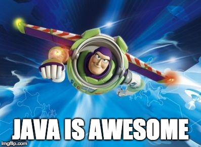

# Scaling Java Application : Vers l’infini et au delà

Un moteur de calcul de prix en Java et scalable jusqu’a l’infini c’est possible ! Mais à notre grande surprise le chemin était pavé d’embuches.
Dans cette présentation, je partage les différentes étapes, les problèmes rencontrés, les solutions ainsi que les outils qui nous ont permit d’attendre cet objectif.
On y parle JVM, Docker, AWS, Off-heap, Caching, Postgresql, Concurrence et autres réjouissances qui sortent un peu de notre quotidien de développeur.

## Slides

Slides du talk : https://vanroy.github.io/to-infinity-and-beyond

## Notes

* [Analyzing java memory usage in a Docker container](http://trustmeiamadeveloper.com/2016/03/18/where-is-my-memory-java/)
* [JDK-4797189 : Finalizers not called promptly enough](https://bugs.java.com/bugdatabase/view_bug.do?bug_id=4797189)
